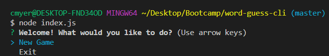
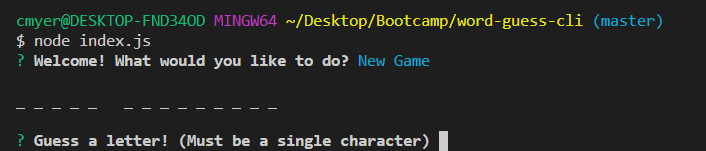
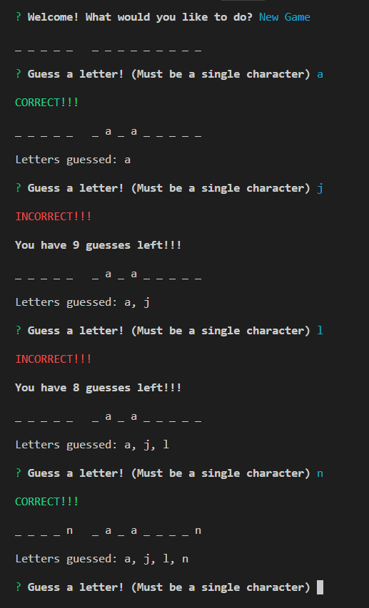
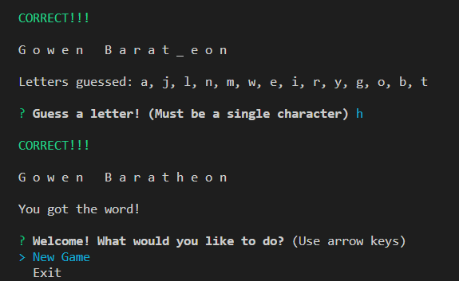
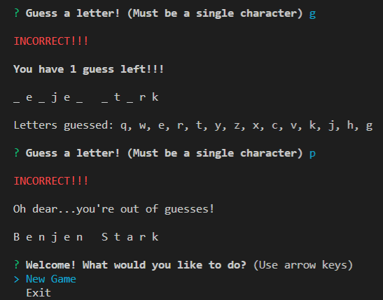

# word-guess-cli

Caleb Myers

## Overview

This is a command line Word Guess game, themed around George R.R. Martin's *A Song of Ice and Fire* (ASOIAF) book series. The program uses a database of ASOIAF information to create new words each round with a randomly selected character name. Having a massive word bank increases the game's replayability, and puts even the biggest fans to the test!

To begin navigate to your local directory containing the program files and run `index.js` with Node.

A menu will appear, allowing you to begin a new game or exit the program.

Once a new game has begun, a number of blanks will appear. These blanks represent a hidden character name. The goal of the game is to guess letters until the full name has been revealed.

A prompt will ask the user to guess letters one by one. If the user's guess is in the hidden name, the character is revealed in the console. If the guess is not a match, the user loses a life. This cycle continues until all letters have been revealed, or the user has run out of lives (Starting with 10 lives).

After a round is finished the user returns to the main menu and is given the choice to start a new game or exit the program.

## Examples

#### Starting a game

When `index.js` is run, the user is first greeted with a welcome menu

After selecting the "New Game" option, a field of blanks will appear that represent a hidden character name.

The user will then guess letters one by one. If the guess is a match, the character is then revealed on the console. If the guess is not a match, the user loses a life.

If the user guesses all of the letters in the hidden character name, they win the round and return to the main menu.

If the user runs out of lives, the round is over. The hidden character name is revealed and the user returns to the main menu.

## Details

This program utilizes Node.js to run outside of a browser.

In addition, several NPM packages are used: inquirer, chalk, and api-iceandfire

**Inquirer** creates the prompts that are easy to navigate, and provide nice aesthetics. This package is used to receive the user's guesses and in the main menu.

**Chalk** allows text with colors and bold styling to be displayed in the console.

**Api-iceandfire** is a Node based wrapper for *An API of Ice And Fire*. This package allows the program to make queries that receive ASOIAF characters to be used as words in the game.

**An API of Ice And Fire** is a fan made API that interacts with a database of information on the ASOIAF book series. This database provides character names that are used in the game.
 * This API can be found at [ASOIAF API](https://anapioficeandfire.com/)